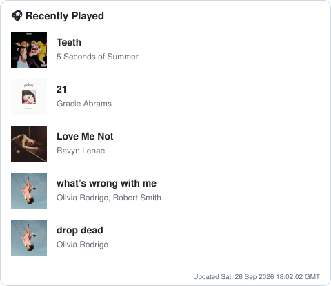
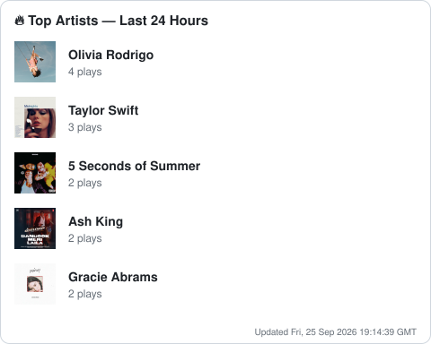
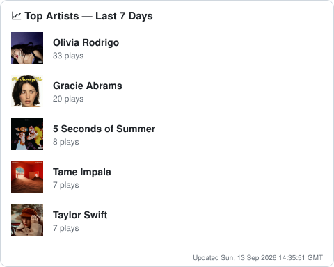

# 👋 Hi, I'm Nipun Chandra

  
  

---

## 🙋 About Me

- 🎓 **Fourth-year Computer Science student** — building thoughtful software one commit at a time.
- 🌱 **Currently exploring** advanced algorithms, system design, and cloud technologies.
- 💬 **Ask me about** Python, JavaScript, React, Node.js, or anything tech-adjacent.
- ⚡ **Fun fact:** I love cooking and bringing dead laptops back to bare functionality.

 

---

## 🛠️ Tech Stack

  
  
  
  
  

  
  
  
  
  

  
  
  
  
  

---

## 🎧 On Repeat

<!--SPOTIFY:start-->
<table>
  <tr>
    <td colspan="2" align="center">
      
    </td>
  </tr>
  <tr>
    <td align="center">
      
    </td>
    <td align="center">
      
    </td>
  </tr>
</table>
<!--SPOTIFY:end-->

Auto-updated every 15 minutes via GitHub Actions + the Spotify Web API.

---

## 🤝 Connect With Me

---

<!--DYNAMIC_QUOTE:start-->
### 💡 *"Confidence comes from crossing thresholds. – Kamal Ravikant"*

*Last updated: April 01, 2026 at 02:00 PM UTC*
<!--DYNAMIC_QUOTE:end-->

